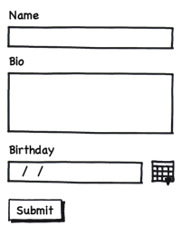

# Forms

---

# Building Your First Form

    !php
    public function newAction(Request $request)
    {
        $form = $formFactory
            ->createFormBuilder()
            ->add('name')
            ->add('bio', 'textarea')
            ->add('birthday', 'date')
            ->getForm();

        return $this->render('AcmeDemoBundle:Default:new.html.twig', [
            'form' => $form->createView(),
        ]);
    }

In order to display the _Form_, you need to pass a special _view_ object to the
View layer. It's achieved through the `createView()` method.

---

# Rendering The Form

 

    !jinja
    {# src/Acme/DemoBundle/Resources/views/Default/new.html.twig #}
    <form action="{{ path('acme_demo.default_new') }}" method="post">
        {{ form_widget(form) }}

        <input type="submit" />
    </form>

---

# Handling Forms: The Right Way

1. When initially loading the page in a browser, the **request method is GET**
and **the form is simply created and rendered**;

2. When the user submits the form (i.e. the method is POST) with **invalid
data**, the **form is bound and then rendered**, this time **displaying all
validation errors**;

3. When the user submits the form with valid data, the form is bound and you have
the **opportunity to perform some actions before redirecting the user** to some
other page (e.g. a "success" page).

Redirecting a user after a successful form submission prevents the user from
being able to hit "refresh" and re-post the data.

---

# Handling Form Submissions

    !php
    public function newAction(Request $request)
    {
        $form = $formFactory
            ->createFormBuilder()
            ->add('name')
            ->add('bio', 'textarea')
            ->add('birthday', 'date')
            ->getForm();

        if ($request->isMethod('POST')) {
            $form->bind($request);

            if ($form->isValid()) {
                $data = $form->getData();
                // do something ...

                return $this->redirect($this->generateUrl('success'));
            }
        }

        // ...
    }

---

# Built-in Form Types

Everything is a **Type**!

---

# Creating A Custom Type (Form Class)

    !php
    use Symfony\Component\Form\AbstractType;
    use Symfony\Component\Form\FormBuilderInterface;
    use Symfony\Component\OptionsResolver\OptionsResolverInterface;

    class PersonType extends AbstractType
    {
        public function buildForm(FormBuilderInterface $builder,
            array $options) {
            $builder
                ->add('name')
                ->add('bio', 'textarea')
                ->add('birthday', 'date');
        }

        public function setDefaultOptions(
            OptionsResolverInterface $resolver) {
            $resolver->setDefaults(array('data_class' => 'My\Person'));
        }

        public function getName()
        {
            return 'person';
        }
    }

---

# Dealing With Objects

    !php
    public function newAction(Request $request)
    {
        $person = new Person();
        $form   = $this->createForm(new PersonType(), $person);

        if ($request->isMethod('POST')) {
            $form->bind($request);

            if ($form->isValid()) {
                $person->save(); // insert a new `person`

                return $this->redirect($this->generateUrl('success'));
            }
        }

        // ...
    }

Placing the form logic into its own class means that the form **can be easily
reused elsewhere** in your project.

This is the **best way to create forms**, but the choice is up to you!

---

# The `processForm()` Method (1/2)

Saving or updating an object is pretty much the same thing. In order to avoid
code duplication, you can use a `processForm()` method that can be used in both
the `newAction()` and the `updateAction()`:

    !php
    /**
     * Create a new Person
     */
    public function newAction()
    {
        return $this->processForm(new Person());
    }

    /**
     * Update an existing Person
     */
    public function updateAction($id)
    {
        $person = ...; // get a `Person` by its $id

        return $this->processForm($person);
    }

---

# The `processForm()` Method (2/2)

    !php
    /**
     * @param Person $person
     *
     * @return Response
     */
    private function processForm(Person $person)
    {
        $form = $this->createForm(new PersonType(), $person);
        $form->bind($this->getRequest());

        if ($form->isValid()) {
            $person->save();

            return $this->redirect($this->generateUrl('success'));
        }

        return $this->render('AcmeDemoBundle:Default:new.html.twig', [
            'form' => $form->createView(),
        ]);
    }

---

# Cross-Site Request Forgery Protection

CSRF is a method by which a malicious user attempts to make your legitimate
users unknowingly **submit data that they don't intend to submit**. Fortunately,
CSRF attacks **can be prevented by using a CSRF token inside your forms**.

CSRF protection works by **adding a hidden field to your form**, called `_token`
by default that **contains a value that only you and your user knows**.

This ensures that the user is submitting the given data. Symfony automatically
validates the presence and accuracy of this token.

The `_token` field is a hidden field and will be automatically rendered if you
include the `form_rest()` function in your template, which ensures that all
un-rendered fields are output.

---

# Rendering a Form in a Template (1/2)

    !jinja
    <form action="" method="post" {{ form_enctype(form) }}>
        {{ form_errors(form) }}

        {{ form_row(form.name) }}

        {{ form_row(form.bio) }}

        {{ form_row(form.birthday) }}

        {{ form_rest(form) }}

        <input type="submit" />
    </form>

> Read more:
[http://symfony.com/doc/master/book/forms.html#rendering-a-form-in-a-template](http://symfony.com/doc/master/book/forms.html#rendering-a-form-in-a-template).

---

# Rendering a Form in a Template (2/2)

* `form_enctype(form)`: if at least one field is a file upload field, this renders
  the obligatory `enctype="multipart/form-data"`;

* `form_errors(form)`: renders any errors global to the whole form (field-specific
   errors are displayed next to each field);

* `form_row(form.name)`: renders the label, any errors, and the HTML form widget
   for the given field inside, by default, a div element;

* `form_rest(form)`: renders any fields that have not yet been rendered. It's
  usually a good idea to place a call to this helper at the bottom of each form
  This helper is also useful for taking advantage of the automatic CSRF Protection.
